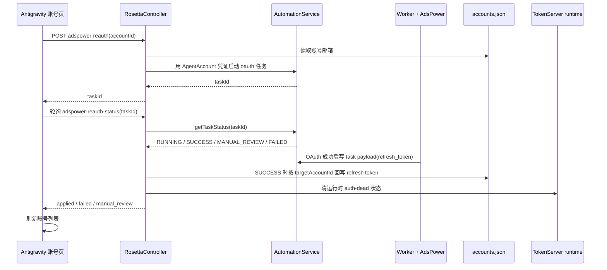

# Antigravity AdsPower 自动重授权设计

## 目标

在 Antigravity 账号池页面提供一键自动重授权能力。操作员点击某个账号的“重新授权”后，系统使用 AdsPower 录入页已经导入过的邮箱、密码、TOTP 凭证，打开 AdsPower 指纹浏览器自动完成 Google OAuth，获取新的 refresh token，并回写到原 Antigravity 账号 id 上。

成功后，该账号应保持原 id、原绑定关系、原份额占用口径不变，同时清掉 `quotaStatus=error`、`quotaStatusReason=invalid_grant` 或 `verification_required` 等旧健康状态，让账号重新进入候选池。

## 背景

当前 Antigravity 账号页的手动“重新授权”调用 `/api/console/rosetta/google-oauth-start`，生成 Google OAuth URL，然后通过普通浏览器打开授权页。操作员需要手动完成授权并粘贴 callback URL 或 code。

AdsPower 批量录入页已经具备完整自动化链路：录入邮箱、密码、恢复邮箱、TOTP 后，后端将凭证保存到 `AgentAccount`，worker 使用 AdsPower profile 登录 Google 并完成 OAuth，成功后把 refresh token 写回 `AgentAccount`，再上传到 Rosetta 账号池。

本次改造要复用这套 AdsPower 自动化能力，但入口从“批量导入新账号”变成“修复已有 Antigravity 账号”。凭证来源限定为 AdsPower 录入页导入过的 `AgentAccount` 记录，不把密码或 TOTP 扩写到 `accounts.json`。

## 设计原则

Antigravity 账号池 `accounts.json` 继续只保存运行所需的上游账号信息和 refresh token，不保存登录密码、TOTP 或恢复邮箱。

自动重授权必须按 Antigravity 账号 id 回写，而不是只按邮箱更新。这样即使邮箱大小写变化、同邮箱历史数据或后续邮箱覆盖存在，也不会误更新其它账号。

手动 Google OAuth 保留为兜底路径。自动重授权失败、没有 `AgentAccount` 凭证、AdsPower 不可用或 Google 要求人工处理时，操作员仍可走现有手动 OAuth。

任务状态必须可轮询、可恢复展示。页面刷新后不能丢失“这个账号正在自动重授权”的结果判断。

## 用户流程

1. 操作员在 Antigravity 账号池页面看到账号状态为“已失效·鉴权失效”或“已失效·需要验证”。
2. 操作员点击账号行里的 AdsPower 自动重授权操作。
3. 前端调用新的 Rosetta 控制台接口，携带 `accountId`。
4. 后端读取 `accounts.json` 中该账号的邮箱，再用邮箱查询 `AgentAccount`。
5. 如果没有对应 `AgentAccount` 或其缺少密码，接口返回明确错误：请先在 AdsPower 录入页导入该邮箱凭证。
6. 如果凭证存在，后端启动 AdsPower `oauth` 自动化任务，并记录 `taskId` 与目标 Antigravity `accountId`。
7. 前端轮询任务状态，展示排队中、登录授权中、成功、需要人工验证或失败。
8. 任务成功后，后端从 task payload 提取 refresh token，调用现有账号更新逻辑按 `targetAccountId` 写回原账号。
9. 回写成功后前端刷新账号列表，状态变回正常或依据最新探活结果展示。

## 后端设计

### Rosetta 账号重授权入口

新增 Rosetta 控制台接口：

```http
POST /api/console/rosetta/adspower-reauth
Content-Type: application/json

{ "accountId": 270 }
```

返回：

```json
{
  "ok": true,
  "accountId": 270,
  "email": "user@example.com",
  "taskId": "task-id",
  "credentialSource": "agentAccount",
  "status": "PENDING"
}
```

职责：

- 校验 `accountId`。
- 从 Antigravity `accounts.json` 找到对应账号和邮箱。
- 查询 `AgentAccount.loginEmail` 等于该邮箱的记录。
- 要求 `AgentAccount.loginPassword` 存在。
- 使用 `AgentAccount.loginPassword`、`recoveryEmail`、`totpSecret` 启动现有 `AutomationService.startAutomation("oauth", ...)`。
- 任务 source 使用 `rosetta-account-reauth`，以便 worker 和状态映射可区分“自动重授权”与“批量录入”。
- 将 `targetAccountId`、`provider=antigravity` 写入 task payload 的非敏感部分，或写入新的轻量本地 reauth 状态文件。

### 任务状态与完成回写

新增轮询接口：

```http
GET /api/console/rosetta/adspower-reauth-status?taskId=task-id
```

返回：

```json
{
  "ok": true,
  "taskId": "task-id",
  "accountId": 270,
  "email": "user@example.com",
  "status": "running",
  "message": "登录授权中",
  "error": ""
}
```

当 `AutomationService.getTaskStatus(taskId)` 返回 `SUCCESS` 时，状态接口负责执行一次幂等回写：

- 从 task payload 的 `result.refresh_token` 或 `token.refresh_token` 提取 refresh token。
- 调用现有 `AntigravityAccountService.addAccountChecked({ targetAccountId, email, refreshToken })`。
- 复用 `addAccount` 已有行为：替换 token、启用账号、清掉 `quotaStatus`、`quotaStatusReason`、`blockedUntil`。
- 调用 `TokenServerService.reactivateIfAuthDead(accountId)` 或等价路径，确保运行时死号状态也被清掉。
- 标记该 reauth 任务为 uploaded/applied，避免重复轮询重复回写。

如果任务进入 `MANUAL_REVIEW`，状态接口返回“需要人工验证”，不回写 token。worker 已有 `keepBrowserOpenOnChallenge` 能保留 AdsPower 浏览器；自动重授权可沿用这一能力，让操作员在 AdsPower 窗口里继续处理。

如果任务进入 `FAILED_FINAL` 或 `FAILED_RETRYABLE`，状态接口返回失败原因，并提示可转手动 OAuth 或重新导入凭证。

### Worker 行为

现有 worker 的 `oauth` 流程已经完成：

- AdsPower profile 获取与打开。
- Google 登录。
- OAuth 授权。
- refresh token 写入 task payload。
- refresh token 自动捕获到 `AgentAccount`。

本次不需要在 worker 里直接写 `accounts.json`。让后端状态接口负责回写，可以避免 worker 依赖 Rosetta 文件服务，也便于前端显示“OAuth 成功但回写失败”的分段错误。

Worker 只需要识别 `source=rosetta-account-reauth` 为 Rosetta 维护任务：

- 使用与 `rosetta-account-repair` 相同的人工挑战等待策略。
- 登录遇到验证码、手机挑战、账号验证时，按现有逻辑进入 `MANUAL_REVIEW`，并在允许时保持浏览器打开。
- 任务 payload 中保留 token，不记录密码、TOTP。

## 前端设计

Antigravity 账号页新增或调整账号行操作：

- “重新授权”默认触发 AdsPower 自动重授权。
- 保留一个“手动 OAuth”兜底入口，继续调用现有 `handleOAuthStart(accountId)`。
- 点击自动重授权后，行内或弹窗展示任务状态：排队中、登录授权中、需要人工验证、成功、失败。
- 成功后自动刷新账号列表。
- 没有 AdsPower 凭证时，toast 显示“未找到 AdsPower 录入凭证，请先在 AdsPower 录入页导入该邮箱”。

页面刷新后的任务可见性：

- 最小实现：本轮前端 state 轮询即可，刷新后用户可重新点击，后端 dedupe 返回已有活跃任务。
- 更完整实现：后端保存最近 reauth 状态，页面加载时按账号 id 拉取未完成任务并继续轮询。

首版采用最小实现，但后端接口必须对同一账号的活跃 `PENDING/RUNNING` reauth 任务去重，避免重复打开多个 AdsPower profile。

## 数据流



## 错误处理

找不到 Antigravity 账号：返回 `ACCOUNT_NOT_FOUND`。

找不到 `AgentAccount` 凭证：返回 `CREDENTIAL_NOT_FOUND`，提示先在 AdsPower 录入页导入该邮箱。

`AgentAccount` 缺少密码：返回 `PASSWORD_MISSING`。

AdsPower profile 打不开：任务进入失败或人工处理状态，前端展示 worker 的错误消息。

Google 要求人工验证：任务进入 `MANUAL_REVIEW`，前端提示在 AdsPower 浏览器中完成验证，或改走手动 OAuth。

OAuth 成功但没有 refresh token：返回 `TOKEN_MISSING`，不回写账号池。

OAuth 成功但账号探活失败：`addAccountChecked` 返回 warning 或错误时，前端展示“授权成功但探活失败”；如果账号被置为停用，保留后端当前行为。

回写成功但运行时状态未清理：状态接口仍返回回写成功，同时记录 warning；前端刷新后若状态仍旧异常，应显示实际状态并允许再次手动恢复。

## 测试计划

后端单元测试：

- `adspower-reauth` 找到 `AgentAccount` 后启动 oauth 任务，并返回 taskId。
- 找不到 `AgentAccount` 时返回 `CREDENTIAL_NOT_FOUND`。
- `adspower-reauth-status` 在 task `SUCCESS` 且 payload 有 refresh token 时，按 `targetAccountId` 更新原账号，而不是新增账号。
- 回写后清掉 `quotaStatus`、`quotaStatusReason`、`blockedUntil`。
- 对同一账号已有活跃 reauth 任务时返回已有 taskId，不重复创建任务。
- task `MANUAL_REVIEW` 时不回写 token，并返回人工处理状态。

前端测试：

- 点击自动重授权按钮会调用新接口并开始轮询。
- 成功状态会刷新账号列表并显示成功提示。
- 凭证缺失错误会提示去 AdsPower 录入页导入凭证。
- 手动 OAuth 兜底入口仍可用。

回归测试：

- 现有手动 Google OAuth 流程不变。
- AdsPower 批量录入页仍按原流程批量导入账号。
- `AntigravityAccountService.addAccount` 的按 id 重授权测试继续通过。

## 非目标

不在 `accounts.json` 中保存密码、TOTP 或恢复邮箱。

不改变 Codex 或 Anthropic 的 OAuth 流程。

不重写 AdsPower 批量录入页。

不改变账号份额、订阅绑定或座位分配逻辑。

不在首版实现跨页面的完整任务中心；仅保证当前账号页能启动、轮询并处理结果。
